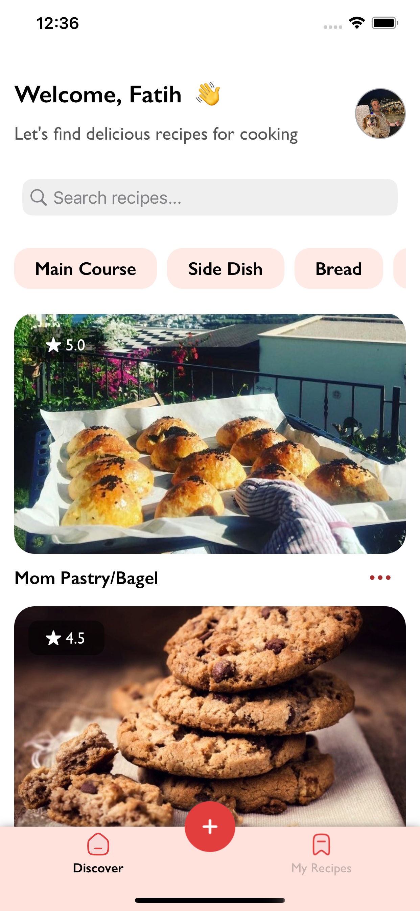
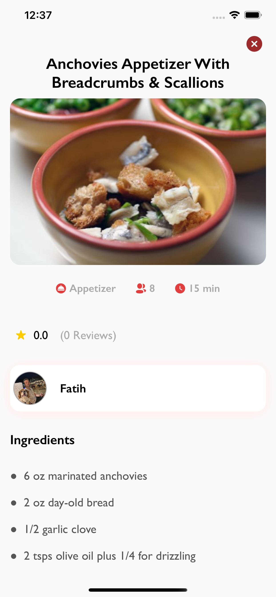
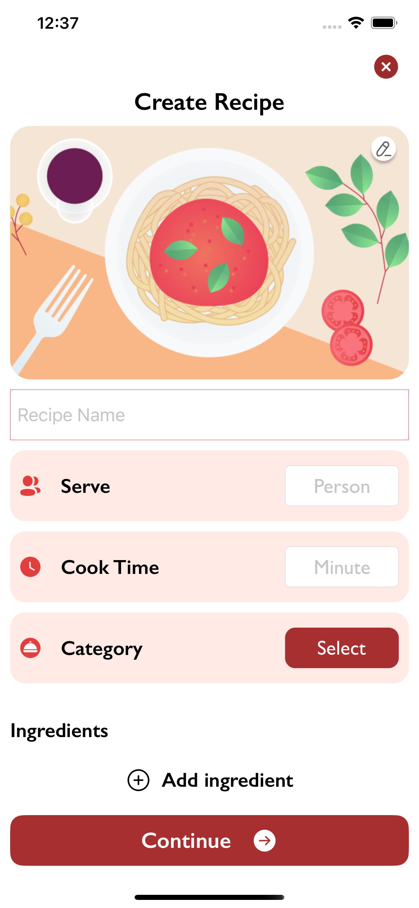
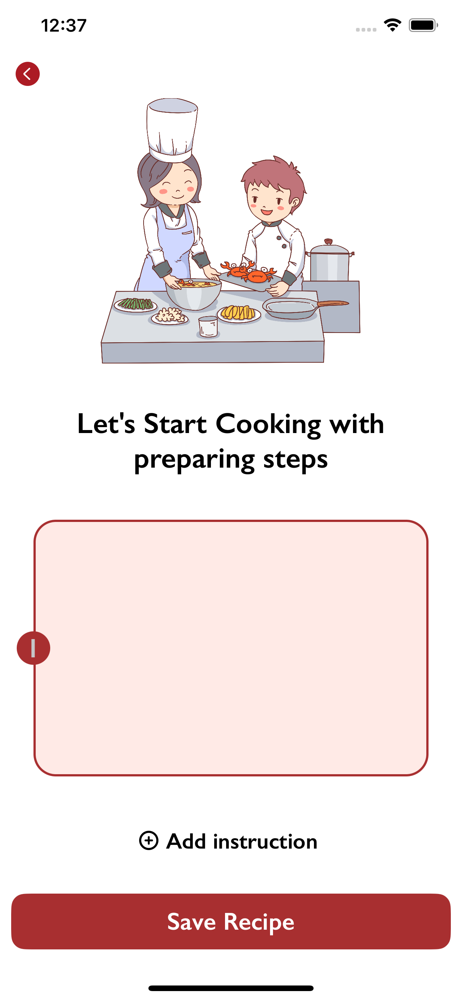
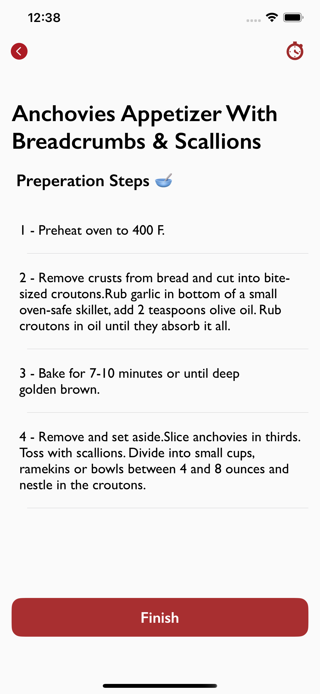
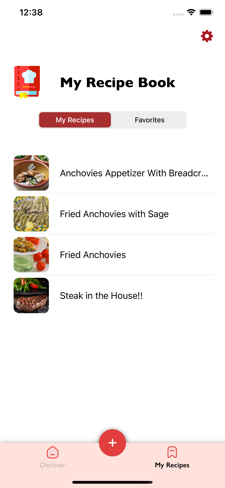
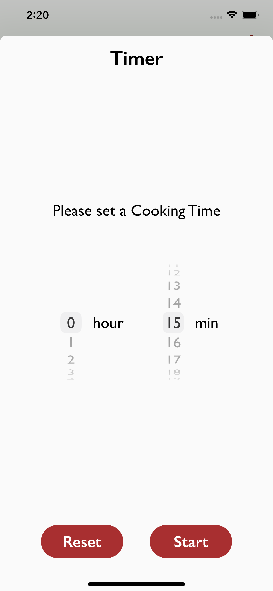

This app is available in the [AppStore](https://apps.apple.com/app/id1641238583)

## Overview
Cuisiner is a user generated recipe/cooking collection app

 - **Discover:** Find other recipes and rate them. Make new meals/drinks with cook timers within recipe detail provided by owner.
 - **Create New:** Save your recipes to your book, keep them and share with people. Enter ingredients and cook instructions & cook time.
 - **My Recipes:** Your own recipe book. Keep or update them.

 ## Framework and Architecture
 - UIKit
 - TimerView -> SwiftUI
 - MVVM-Coordinator Design Pattern
 - Data Binding: Protocol Oriented
 - Generic Network Layer for Firebase Services
 
 ## Navigation
 - Coordinator pattern for screen routing
 
``` 
 class AppCoordinator: Coordinator {

    var childCoordinators = [Coordinator]()
    var navigationController: UINavigationController
    
    init(navigationController: UINavigationController) {
        self.navigationController = navigationController
    }
    
    func start(isLogIn: Bool) {
        isLogIn ? gotoTabBar() : gotoAuth()
    }
    
    func childDidFinish(_ child: Coordinator) {
        for (index, coordinator) in childCoordinators.enumerated() {
            if coordinator === child { childCoordinators.remove(at: index) }
        }
    }
    
    func gotoAuth() {
        let authCoordinator = AuthCoordinator(navigationController: navigationController)
        authCoordinator.parentCoordinator = self
        childCoordinators.append(authCoordinator)
        authCoordinator.start()
    }
    
    func gotoTabBar() {
        let tabBarCoordinator = TabBarCoordinator(navigationController: navigationController)
        tabBarCoordinator.parentCoordinator = self
        childCoordinators.append(tabBarCoordinator)
        tabBarCoordinator.start()
    }
```

## Data Persistence
- Core Data     -> Recipe Bookmark
- UserDefaults  -> User Login

## Firebase
- Firebase Authentication
- [Firestore](https://firebase.google.com/products/firestore/)
- [Storage](https://firebase.google.com/products/storage)


## Screenshots
 







